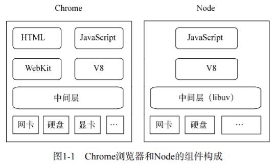

# 第1章 Node简介
> Node应该是如今最火热的技术了，从本章开始，我们将逐步揭示它的诸多细节。

## 1.1 Node的诞生历程
Node的诞生历程如下：
- 2009年3月，Ryan Dahl在其博客上宣布准备基于V8创建一个轻量级的Web服务器并提供一套库。
- 2009年5月，Ryan Dahl在GitHub上发布了最初的版本。
- 2009年12月和2010年4月，两届JSConf大会都安排了Node的讲座。
- 2010年年底，Node获得硅谷云计算服务商Joyent公司的资助，其创始人Ryan Dahl加入Joyent公司全职负责Node的发展。
- 2011年7月，Node在微软的支持下发布了其Windows版本。
- 2011年11月，Node超越Ruby on Rails，成为GitHub上关注度最高的项目，随后被Bootstrap超越
- 2012年1月底，Ryan Dahl将掌门人的身份转交给Isaac Z.Schlueter，Isaac Z.Schlueter是包管理器npm的作者，之后Node的版本发布和bug修复等工作都由他接手。

## 1.2 Node的命名和起源
### 1.2.1 为什么是JavaScript
Ryan Dahl是一名资深的C/C++程序员，在创造Node之前，他的主要工作是围绕高性能Web服务器进行的。经过一系列尝试和失败之后，他认为设计高性能Web服务器的要点包括事件驱动、非阻塞I/O。

所以Ryan Dahl最初的目标是写一个基于事件驱动、非阻塞I/O的Web服务器，以达到更高的性能，提供更多的选择。创造Node的时候，Ryan Dahl曾经评估过C、Lua、Haskell、Ruby等语言作为备选实现，结论是：C的开发门槛高，可以预见不会有太多的开发者能将它用于日常的业务开发，所以舍弃它；自己还没能够玩转Haskell，所以舍弃它；Lua自身已经含有很多阻塞I/O的库，舍弃它；Ruby的虚拟机性能不好，舍弃它。

相比之下，JavaScript比C的开发门槛低，比Lua的历史包袱少。尽管服务器端JavaScript存在已经很多年了，但是后端部分一直没有市场，可以说历史包袱为0，为其导入非阻塞I/O库没有额外阻力。另外，JavaScript在浏览器中有广泛的事件驱动方面的应用，合乎基于事件驱动的需求。考虑到高性能、符合事件驱动、没有历史包袱这3个原因，JavaScript成为了Node的实现语言。

### 1.2.2 为什么叫Node
起初，Ryan Dahl称他的项目为web.js，就是一个web服务器，但是项目的发展超过了他最初单纯开发一个Web服务器的想法，变成了构建网络应用的一个基础框架，这样可以在它的基础上构建更多的东西，诸如服务器、客户端、命令行工具等。Node发展为一个强制不共享任何资源的单线程、单进程系统，包含十分适宜网络的库，为构建大型分布式应用程序提供基础设施，其目标也是成为一个构建快速、可伸缩的网络应用平台。它自身非常简单，通过通信协议来组织许多Node，非常容易通过扩展来达成构建大型网络应用的目的。每一个Node进程都构成这个网络应用中的一个节点，这是它名字所含意义的真谛。

## 1.3 Node给JavaScript带来的意义
V8给Chrome浏览器带来了一个强劲的心脏，使得Chrome在浏览器大战中脱颖而出。先说说Node与浏览器的对比，如图所示。


除了HTML、WebKit和显卡这些UI相关技术没有支持外，Node的结构与Chrome十分相似。它们都是基于事件驱动的异步架构，浏览器通过事件驱动来进行页面上的交互，Node通过事件驱动来服务I/O。在Node中，JavaScript可以随心所欲地访问本地文件，可以搭建WebSocket服务器端，可以连接数据库，可以如Web Workers一样玩转多进程。Node打破了过去JavaScript只能在浏览器中运行的局面。前后端编程环境统一，可以大大降低前后端转换代价。

## 1.4 Node的特点
Node作为后端js的运行平台，保留了前端浏览器JavaScript中那些熟悉的特性，依旧基于作用域和原型链，区别在于它将前端中广泛运用的思想迁移到了服务器端。

### 1.4.1 异步I/O
```js
let fs = require('fs');

fs.readFile('./path', (err, data) => {
    console.log(data);
});

console.log("这里先执行");
```


在Node中，绝大多数的操作都是以异步的方式进行调用。Ryan Dahl排除万难，在底层构建了很多异步I/O的API，从文件读取到网络请求等。在Node中，我们可以从语言层面很自然地进行并行I/O操作。每个调用之间无须等待之前的I/O调用结束。异步I/O的耗时取决于最慢的那个任务的耗时，对于同步I/O而言，耗时是任务的耗时之和。这里异步I/O的优势是显而易见的。

### 1.4.2 事件与回调函数
事件的编程方式具有轻量级、松耦合、只关注事务点等优势，但是在多个异步任务的场景下，事件与事件之间各自独立，如何协作是一个问题。
回调函数是最好的接受异步调用返回数据的方式。但是这种编程方式对于很多习惯同步思路编程的人来说会造成阅读上的障碍。

### 1.4.3 单线程
在Node中，JavaScript与其余线程是无法共享状态的。单线程的最大好处就是不用像多线程那样处处在意状态的同步问题，这里没有死锁的存在，也没有线程切换所带来的性能开销。同时单线程也有它自身的弱点：
- 无法利用多核CPU
- 错误会引起整个应用退出，应用的健壮性值得考验。
- 大量计算占用CPU导致无法继续调用异步I/O。

像浏览器中JavaScript与UI共用一个线程一样，JavaScript长时间执行会导致UI的渲染和响应被中断。在Node中，长时间的CPU占用也会导致后续的异步I/O发不出调用，已完成的异步I/O的回调函数也会得不到及时执行。

HTML5定制了Web Workers的标准来解决上述的大计算量问题。Web Workers能够创建工作线程来进行计算，以解决JavaScript大计算阻塞UI渲染的问题。工作线程为了不阻塞主线程，通过消息传递的方式来传递运行结果，这也使得工作线程无法访问到主线程中的UI。

Node采用了与Web Workers相同的思路来解决单线程中大计算量的问题：child_process。
子进程的出现，Node可以通过将计算分发到各个子进程，将大量计算分解掉，然后再通过进程之间的事件消息来传递结果，这可以很好地保持应用模型的简单和低依赖。

## 1.5 Node的应用场景
- I/O密集型
- 分布式应用