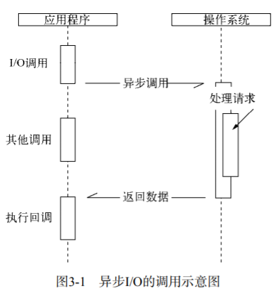
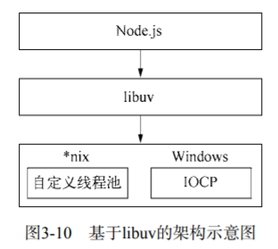
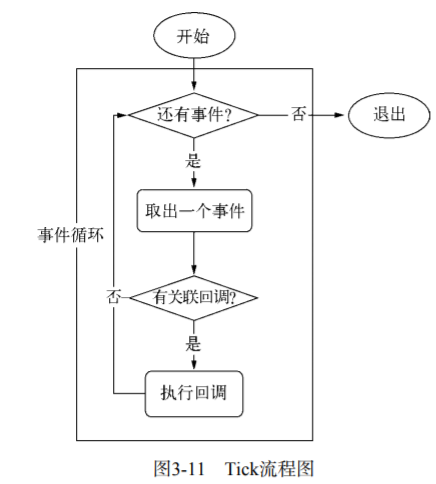
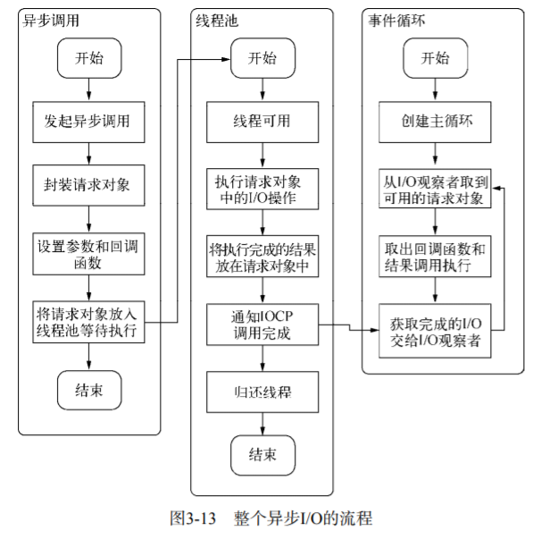

# 第三章 异步I/O
“异步”这个名词其实很早就诞生了，但它的大规模流行却是在Web2.0浪潮中，它伴随着ajax的第一个字母a（asynchronous）席卷了web。Node在出现之前，最习惯异步编程的程序员莫过于前端工程师了。前端开发中充斥了各种ajax和事件，这些都是典型的异步应用场景。

但实际上，异步早就存在于操作系统的底层。在底层系统中，异步通过信号量、消息等方式有了更广泛的应用。意外的是，在绝大多数高级编程语言中，异步并不多见，就好象被屏蔽了一般。造成这个现象的主要原因或许会令人惊讶：程序员不太适合通过异步来进行程序设计。

php这门语言的设计最能体现这个观点。它对调用程不仅屏蔽了异步，甚至连多线程都不提供。php语言从头到脚都是以同步阻塞的方式来执行的。它的优点十分明显，利于程序员顺畅编写业务逻辑，它的缺点在小规模站点中基本不存在，但是在复杂的网络应用中，阻塞导致它无法更好地并发。

而在其它语言中，尽管可能存在异步的API，但是程序员还是习惯采用同步的方式来编写应用。在众多高级编程语言或运行平台中，将异步作为主要编程方式和设计理念的，Node是首个。

伴随着异步I/O的还有事件驱动和单线程，它们构成Node的基调，Ryan Dahl正是基于这几个因素设计了Node。Ryan Dahl最初期望设计出一个高性能的web服务器，后来则演变为一个可以基于它构建各种高速、可伸缩网络应用的平台，因为一个web服务器已经无法完全涵盖和代表它的能力了。尽管它不再是一个服务器，但是可以基于它搭建更多更丰富更强大的网络应用。

与Node的事件驱动、异步I/O设计理念比较相近的一个知名产品为Nginx。Nginx采用c语言编写，性能表现非常优异。它们的区别在于，Nginx具备面向客户端管理连接的强大能力，但是它的背后依然受限于各种同步方式的编程语言。但Node却是全方位的，既可以作为服务器端去处理客户端带来的大量并发请求，也能作为客户端向网络中的各个应用进行并发请求。

## 3.1 为什么要异步I/O
关于异步I/O为何在Node里如此重要，这与Node面向网络而设计不无关系。web应用已经不再是单台服务器就能胜任的时代了，在跨网络的架构下，并发已经是现代编程中的标准配备了。具体到实处，则可以从用户体验和资源分配这两个方面说起。

### 3.1.1 用户体验
异步的概念之所以首先在Web2.0中火起来，是因为在浏览器中JavaScript在单线程上执行，而且它还与UI渲染共用一个线程。这意味着JavaScript在执行的时候UI渲染和响应是处于停滞状态的。《高性能JavaScript》一书中曾经总结过，如果脚本的执行时间超过100毫秒，用户就会感到页面卡顿，以为网页停止响应。而在B/S模型中，网络速度的限制给网页的实时体验造成很大的麻烦。如果网页临时需要获取一个网络资源，通过同步的方式获取，那么JavaScript则需要等待资源完全从服务器端获取后才能继续执行，这期间UI将停顿，不响应用户的交互行为。可以想象，这样的用户体验将会多差。而采用异步请求，在下载资源期间，JavaScript和UI的执行都不会处于等待状态，可以继续响应用户的交互行为，给用户一个鲜活的页面。

同理，前端通过异步可以消除掉UI阻塞的现象，但是前端获取资源的速度也取决于后端的响应速度。假如一个资源来自于两个不同位置的数据的 返回，第一个资源需要M毫秒的耗时，第二个资源需要N毫秒的耗时，对比异步同步两种方式的时间总消耗，同步为M+N，异步为max(M,N)。随着应用复杂性的增加，同步与异步的优势将会凸显出来。另一方面，随着网站或应用不断膨胀，数据将会发布到多台服务器上，分布式将会是常态。分布也意味着M与N的值会线性增长，这也会放大异步和同步在性能方面的差异。

I/O是昂贵的，分布式I/O是更昂贵的，只有后端能够快速响应资源，才能让前端的体验变好。

### 3.1.2 资源分配
假设业务场景中有一组互不相关的任务需要完成，现行的主流方法有以下两种：
- 单线程串行依次执行
- 多线程并行完成

多线程的代价在于创建线程和执行期间线程上下文切换的开销比较大。另外，在复杂的业务中，多线程编程经常面临锁、状态同步等问题，这是多线程被诟病的主要原因。但是多线程在多核CPU上能够有效提升CPU的利用率，这个优势是毋庸置疑的。

单线程顺序执行任务的方式比较符合编程人员按顺序思考的思维方式。它依然是最主流的编程方式，因为它易于表达。但是串行执行的缺点在于性能，任何一个略慢的任务都会导致后续执行代码被阻塞。在计算机资源中，通常I/O与CPU计算之间是可以并行进行的。但是同步编程导致的问题是，I/O的进行会让后续任务等待，这造成资源不能更好地被利用。

而Node给出了它自己的方案：利用单线程，远离多线程死锁、状态同步等问题，利用异步I/O，让单线程远离阻塞，以更好地利用CPU。为了弥补单线程无法利用多核CPU的缺点，Node提供了类似前端浏览器中web workers的子进程，该子进程可以通过工作进程高效地利用CPU和I/O。



## 3.2 异步I/O实现现状
### 3.2.1 异步I/O与非阻塞I/O
异步和非阻塞听起来似乎是同一回事，从实际效果而言，异步和非阻塞都达到了我们并行I/O的目的。但是从计算机内核I/O而言，异步/同步和阻塞/非阻塞实际上是两回事。

操作系统内核对于I/O只有两种方式：阻塞与非阻塞。在调用阻塞I/O时，应用程序需要等待I/O完成才返回结果。

阻塞I/O的一个特点是调用之后一定要等到系统内核层面完成所有操作后，调用才结束。以读取磁盘上的一段文件为例，系统内核在完成磁盘寻道、读取数据、复制数据到内存中之后，这个调用才结束。

阻塞I/O造成CPU等待I/O，浪费等待时间，CPU的处理能力不能得到充分利用。为了提高性能，内核提供了非阻塞I/O。非阻塞I/O和阻塞I/O的差别为调用之后会立即返回。

操作系统对计算机进行了抽象，将所有输入输出设备抽象为文件。内核在进行文件I/O操作时，通过文件描述符进行管理，而文件描述符类似于应用程序与系统内核之间的凭证。应用程序如果需要进行I/O调用，需要先打开文件描述符，然后再根据文件描述符去实现文件的数据读写。

此处非阻塞I/O与阻塞I/O的区别在于阻塞I/O完成整个获取数据的过程，而非阻塞I/O则不带数据直接返回，要获取数据，还需要通过文件描述符再次读取。非阻塞I/O返回之后，CPU的时间片可以用来处理其它事务，此时性能的提升是明显的。

但非阻塞I/O也存在一些问题：由于完整的I/O并没有完成，立即返回的并不是业务层期望的数据，而仅仅是当前调用的状态。为了获取完整的数据，应用程序需要重复调用I/O操作来确认是否完成。这种重复调用判断是否完成I/O操作的技术叫做轮询。

阻塞I/O造成CPU等待浪费，非阻塞带来的不足是需要轮询去确认，它会让CPU处理状态判断，是对CPU资源的浪费。

### 3.2.2 理想的非阻塞异步I/O
我们期望的完美的异步I/O应该是应用程序发起非阻塞调用，无需通过遍历或者事件唤醒等方式轮询，可以直接处理下一个任务，只需在I/O完成后通过信号或回调将数据传递给应用程序即可。

### 3.2.3 现实的异步I/O
由于windows平台和linux平台的差异，Node提供了libuv作为抽象封装层，使得所有平台兼容性的判断都由这一层来完成。


## 3.3 Node的异步I/O
### 3.3.1 事件循环
首先，着重强调一下Node自身的执行模型：事件循环，正是它使得回调函数十分普遍。

在进程启动时，Node便会创建一个类似于`while(true)`的循环，每执行一次循环体的过程称为Tick。每个Tick的过程就是查看是否有事件待处理，如果有，就取出事件及其相关的回调函数。如果存在关联的回调函数，就执行它们，然后进入下个循环，如果不再有事件处理，就退出进程。


### 3.3.2 观察者
在每个Tick的过程中，如何判断是否有事件需要处理呢？这里必须要引入的概念是观察者。每个事件循环中有一个或者多个观察者，而判断是否有事件要处理的过程就是向这些观察者询问是否有要处理的事件。

这个过程就如同饭馆的厨房，厨房一轮一轮地制作菜肴，但是要具体制作哪些菜肴取决于收银台收到的客人的下单。厨房每做完一轮菜肴，就去问收银台的人，接下来有没有要做的菜，如果没有的话，就下班了。在这个过程中，收银台的服务人员就是观察者，他收到的客人点单就是关联的回调函数。当然，如果饭馆经营有方，它可能有多个收银员，就如同事件循环中有多个观察者一样。收到下单就是一个事件，一个观察者里可能有多个事件。

浏览器采用了类似的机制。事件可能来自用户的点击或者加载某些文件时产生，而这些产生的事件都有对应的观察者。在Node中，事件主要来源于网络请求、文件I/O等，这些事件对应的观察者有文件I/O观察者、网络I/O观察者等。观察者将事件进行了分类。

事件循环是一个典型的生产者/消费者模型。异步I/O、网络请求等则是事件的生产者，源源不断为Node提供不同类型的事件，这些事件被传递到对应的观察者那里，事件循环则从观察者那里取出事件并处理。

在Windows下，这个循环基于IOCP创建，而在*nix下则基于多线程创建。

### 3.3.3 请求对象
对于一般的非异步回调函数，函数由我们自行调用，对于Node中的异步I/O调用而言，回调函数却不由开发者来调用。那么从我们发出调用后，到回调函数被执行，中间发生了什么呢？事实上，从JavaScript发起调用到内核执行完I/O操作的过渡过程中，存在一种中间产物，它叫做请求对象。

下面我们以最简单的`fs.open()`方法来作为例子，探索Node与底层之间是如何执行异步I/O调用以及回调函数究竟是如何被调用执行的：
```js
fs.open = function(path, flags, mode, callback) {
    // ...
    binding.open(pathModule, makeLong(path), stringToFlags(flags), mode, callback);
}
```
fs.open()的作用是根据指定路径和参数去打开一个文件，从而得到一个文件描述符，这是后续所有I/O操作的初始操作。JavaScript层面的代码通过调用c++核心模块进行下层的操作。从JavaScript调用Node的核心模块，核心模块调用c++内建模块，内建模块通过libuv进行系统调用，这是Node里经典的调用方式。

从JavaScript层传入的参数和当前方法都被封装在这个请求对象中，其中我们最为关注的回调函数则被设置在这个对象的`oncomplete_sym`属性上。请求对象是异步I/O过程中的重要中间产物，所有的状态都保存在这个对象中，包括送入线程池等待执行以及I/O操作完毕后的回调处理。



事件循环、观察者、请求对象、I/O线程池这四者共同构成了Node异步I/O模型的基本要素。事实上，在Node中，除了JavaScript是单线程外，Node自身其实是多线程的，只是I/O线程使用的CPU较少。

## 3.4 非I/O的异步API
### 3.4.1 定时器
setTimeout()和setInterval()与浏览器中的API是一致的，分别用于单次和多次定时执行任务。它们的实现原理与异步I/O类似，只是不需要I/O线程池的参与。调用setTimeout()或者setInterval()创建的定时器会被插入到定时器观察者内部的一个红黑树中。每次Tick执行时，会从该红黑树中取出定时器对象，检查是否超过定时时间，如果超过，就形成一个事件，它的回调函数将立即执行。

定时器的问题在于，它并非是精确的。尽管事件循环十分快，但是如果某一次循环占用的时间较多，那么下次循环时，它也许已经超时很久了。

### 3.4.2 process.nextTick()
在未了解`process.nextTick()`之前，很多人也许为了立即异步执行一个任务，会这样调用setTimeout()来达到所需的效果：
```js
setTimeout(()=>{}, 0);
```
由于事件循环自身的特点，定时器的精确度不够。而事实上，采用定时器需要动用红黑树，创建定时器对象和迭代等操作，setTimeout(fn, 0)的方式较为浪费性能。实际上，process.nextTick()方法的操作相对较为轻量：
```js
process.nextTick = function(callback) {
    if(process._exiting) return;

    if(tickDepth >= process.maxTickDepth)
        maxTickWarn();
    
    var tock = {callback : callback};
    if(process.domain) tock.domain = process.domain;
    nextTickQueue.push(tock);
    if(nextTickQueue.length) {
        process._needTickCallback();
    }
};
```
每次调用process.nextTick方法，只会将回调函数放入队列中，在下一轮Tick时取出执行。定时器中采用红黑树的操作时间复杂度为O(lg(n))，nextTick()的时间复杂度为O(1)。相较之下，process.nextTick更为高效。

### 3.4.3 setImmediate()
setImmediate()方法和process.nextTick十分相似，都是将回调函数延迟执行。但是两者之间其实是有细微差别的。process.nextTick中的回调函数执行的优先级要高于setImmediate()。这里的原因在于事件循环对观察者的检查是有先后顺序的，process.nextTick()属于idle观察者，setImmediate()属于check观察者。在每一轮循环检查中，idle观察者先于I/O观察者，I/O观察者先于check观察者。在具体实现上，process.nextTick()的回调函数保存在一个数组中，setImmediate()的结果则是保存在链表中。在行为上，process.nextTick()在每轮循环中，会将数组中的回调函数全部执行完，而setImmediate()在每轮循环中执行链表中的一个回调函数。
```js
process.nextTick(()=>{
    console.log('nextTick执行1');
});
process.nextTick(()=>{
    console.log('nextTick执行2');
});

setImmediate(() => {
    console.log('setImmediate执行1');

    process.nextTick(() => {
        console.log('强势插入');
    });
});
setImmediate(() => {
    console.log('setImmediate执行2');
})
```
之所以这样设计setImmediate()，是为了保证每轮循环能够较快地执行结束，防止CPU占用过多而阻塞后续I/O调用的情况。

## 3.5 事件驱动与高性能服务器
事件驱动的实质：通过主循环加事件触发的方式来运行程序。下面为几种经典的服务器模型的对比：
- 同步式：对于同步式的服务，一次只能处理一个请求，并且其余请求都处于等待状态。
- 每进程/每请求：为每个请求启动一个进程。
- 每线程/每请求：为每个请求启动一个线程来处理。由于每个线程都占用一定内存，当大并发请求到来时，内存将会很快用光，导致服务器缓慢。

Node通过事件驱动的方式处理请求，无须为每个请求创建额外的对应线程，可以省掉创建线程和销毁线程的开销，同时操作系统在调度任务时因为线程较少，上下文切换的代价很低。这使得服务器能够有条不紊地处理请求。
