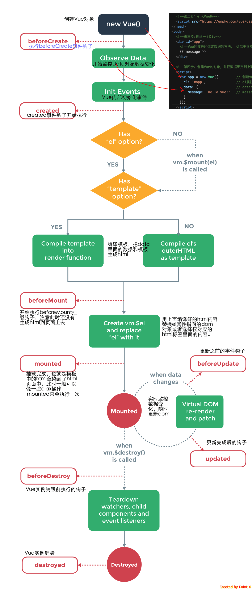

# vue
- 使用vue.js基础框架
- 使用@vue/cli脚手架搭建项目
- 使用vue-router做路由管理
- 使用vuex管理共享所有组件状态
- 使用UI框架
- 使用vue-devtools调试工具
- 使用axios做前后端交互
- 使用webpack打包构建
- 使用eslint、prettier代码检查、统一代码风格

vue视图不更新：
当你把一个普通的js对象传给vue实例的data选项，vue将遍历此对象所有的属性，并使用`Object.defineProperty`把这些属性全部转为getter/setter。

vue不能检测到对象属性的添加和删除，只有在data里初始化的数据才是响应的：
```js
data: {
  a: {
    b: 10
  }
}
// 添加属性
this.$set(this.a, "c", 122);
this.a = Object.assign({}, this.a, {c: 122});
```
通过利用索引设置数组项和改变数组的长度这两种方式，vue检测不到变动
```js
data: {
  arr: [1,2,3]
}

this.$set(this.arr, 4, "aa");
```

## 生命周期函数（钩子函数）
- beforeCreate
- created
- beforeMount
- mounted
- beforeUpdate
- updated
- beforeDestroy
- destroyed



## 指令和模板
### 模板
Vue使用了基于HTML的模板语法，在底层的实现上，Vue将模板编译成虚拟DOM渲染函数。结合响应系统，Vue能够智能地计算出最少需要重新渲染多少组件，并把DOM操作次数减到最少。

对于所有的数据绑定，vue都提供了完全的JavaScript表达式支持，每个绑定限制只能包含单个表达式
```html
{{ number + 1 }}

{{ ok ? 'YES' : 'NO' }}

{{ message.split('').reverse().join('') }}

<div v-bind:id="'list-' + id"></div>
```
模板的表达式都被放在沙盒中，只能访问全局变量的一个白名单，如`Math`和`Date`。你不应该在模板的表达式中试图访问用户定义的全局变量。

### 指令
- v-if：条件渲染、v-else-if、v-else
- v-show：带有v-show的元素始终会被渲染并保留在DOM中，v-show只是切换css属性display
- v-for：列表渲染、遍历数组元素、遍历对象属性
- v-on：监听DOM事件
- v-bind：当`v-bind`用于`class`属性和`style`属性时，vue专门做了增强，表达式结果的类型可以是字符串、对象和数组
- v-model：表单元素创建双向数据绑定
- v-html：双大括号会将数据解释为普通文本，而非html代码。使用v-html可以将内容整个替换为html
- v-text
- v-slot

v-if切换多个元素：
```html
<template v-if="ok">
  <h1>Title</h1>
  <p>Paragraph 1</p>
  <p>Paragraph 2</p>
</template>

<!-- 最终的渲染结果不包含template元素 -->
```
`v-if`vs`v-show`：
`v-if`是真正的条件渲染，因为它会确保在切换过程中条件块内的事件监听器和子组件适当地被销毁和重建，`v-if`具有更高的切换开销，`v-show`具有更高的初始渲染开销。

`v-on`:
```js
<button v-on:click="warn('Form cannot be submitted yet.', $event)">
    Submit
</button>

methods: {
    warn: function (message, event) {
        // 现在我们可以访问原生事件对象
        if (event) {
        event.preventDefault()
        }
        alert(message)
    }
}
```

`v-model`：
它会根据控件类型自动选取正确的方法来更新数据：
- text和textarea元素使用value属性和input事件
- checkbox和radio使用checked属性和change事件
- select元素将value作为prop并将change作为事件

自定义组件的`v-model`：
```js
Vue.component('base-checkbox', {
  model: {
    prop: 'checked',
    event: 'change'
  },
  props: {
    checked: Boolean
  },
  template: `
    <input
      type="checkbox"
      v-bind:checked="checked"
      v-on:change="$emit('change', $event.target.checked)"
    >
  `
})

<base-checkbox v-model="lovingVue"></base-checkbox>
// 注意你仍然需要在组件的 props 选项里声明 checked 这个 prop。
```

自定义指令：
```js
// 注册一个全局自定义指令 `v-focus`
Vue.directive('focus', {
	// 当被绑定的元素插入到 DOM 中时……
	inserted: function (el) {
		// 聚焦元素
		el.focus()
	}
})
```
注册局部指令`v-focus`
```js
directives: {
	focus: {
		// 被绑定元素插入父节点时调用
		inserted: function (el) {
		el.focus()
		}
	}
}
```
指令的钩子函数
- `bind`：只调用一次，指令第一次绑定到元素时调用
- `inserted`：被绑定元素插入父节点时调用
- `update`：所在组件的VNode更新时调用
- `componentUpdated`：指令所在组件的VNode及其子VNode全部更新后调用
- `unbind`：只调用一次，指令与元素解绑时调用

指令钩子函数参数：
- `el`：指令所绑定的元素，可以用来直接操作DOM
- `binding`：一个对象，包含以下属性：
	- name
	- value
	- oldValue
	- expression
	- arg
	- modifiers
- `vnode`
- `oldVnode`

动态参数：
```html
<a v-on:[eventName]="doSomething"> ... </a>
```
eventName可以作为一个js表达式进行动态求值，比如其值为`click`，那么就是`v-on:click="dosomething"`，我们可以使用动态参数为一个动态的事件名绑定处理函数。
对动态参数的约束：
1. 动态参数的值为`null`，可以被显性地用于移除绑定，其它情况下只能使用字符串
2. 动态参数表达式约束不能使用空格和引号，变通的方法是使用计算属性替换这种表达式
3. 避免使用大写字母来命名动态参数键名

修饰符：
用于指出一个指令应该以特殊方式绑定
```html
<form v-on:submit.prevent="onSubmit"> ... </form>

<!-- 只有在 `key` 是 `Enter` 时调用 `vm.submit()` -->
<input v-on:keyup.enter="submit">
```
- `.stop`
- `.prevent`：阻止事件默认行为
- `.capture`：使用事件捕获模式
- `.self`：当`event.target`是当前元素自身的时候才会触发
- `.once`：只会触发一次事件
- `.passive`
- 按键修饰符
- 鼠标按钮修饰符：`.left`、`.right`、`.middle`

### 特殊属性
key属性：
主要用在vue的虚拟dom算法上，在新旧nodes对比时辨识vnodes。如果不使用key，vue会使用一种最大限度减少动态元素并且尽可能地尝试就地修改/复用相同类型元素的算法。而使用key时，它会基于key的变化重新排列元素顺序，并且会移除key不存在的元素。
```html
<transition>
  <span :key="text">{{ text }}</span>
</transition>

<!-- 当text发生改变时，span标签总是被替换而不是被修改，可以触发过渡 -->
```

## 实例属性
计算属性：
在模板中放入太多的复杂表达式会让模板过重且难以维护，对于任何复杂逻辑，应当使用计算属性。
```js
const vm = new Vue({
    el: '#example',
    data: {
        message: 'Hello'
    },
    computed: {
        // 计算属性的 getter
        reversedMessage: function () {
        // `this` 指向 vm 实例
        return this.message.split('').reverse().join('')
        }
    }
})

// 计算属性默认只有getter，不过也可以提供setter
// ...
computed: {
    fullName: {
        // getter
        get: function () {
        return this.firstName + ' ' + this.lastName
        },
        // setter
        set: function (newValue) {
        var names = newValue.split(' ')
        this.firstName = names[0]
        this.lastName = names[names.length - 1]
        }
    }
}
// ...
```

Vue 知道 `vm.reversedMessage` 依赖于 `vm.message`，因此当 `vm.message` 发生改变时，所有依赖 `vm.reversedMessage` 的绑定也会更新。
计算属性与`methods`中的方法不同之处是计算属性是基于它们的响应式依赖进行缓存的。只有相关响应式依赖发生改变时它们才会重新求值，意味着不必多次执行函数。

侦听属性：
vue使用`watch`提供了一个更通用的方法来响应数据的变化，当需要在数据变化时执行异步或者开销较大的操作时，这个方式是最有用的。
```js
data: {
    question: ''
},
watch: {
    question: function(newVal, oldVal) {
        // 异步操作...
    }
}
```

- $root：访问根实例
- $parent：访问父组件实例
- $refs：一个对象，持有注册过 ref 的 DOM 元素或组件实例。
- $children：当前实例的直接子组件
- $slots：访问被插槽分发的内容
- $data：vue实例观察的数据对象
- $props：当前组件接受到的props
- $el：vue实例使用的根DOM元素
- $options：需要在选项中包含自定义属性时会有用处
- $attrs：包含了父作用域中不作为 prop 被识别 (且获取) 的特性绑定

过滤器：
过滤器可以用在两个地方：双花括号插值和`v-bind`表达式
```html
<!-- 在双花括号中，管道符号 -->
{{ message | capitalize }}

<!-- 在 `v-bind` 中 -->
<div v-bind:id="rawId | formatId"></div>
```
```js
filters: {
	capitalize: function (value) {
		if (!value) return ''
		value = value.toString()
		return value.charAt(0).toUpperCase() + value.slice(1)
	}
}
```

## Vue API
- Vue.extend(options)
- Vue.set(target, key, value)
- Vue.directive(id, [definition])
- Vue.filter(id, [definition])
- Vue.component(id, [definition])

## Vue组件
组件是可复用的vue实例，一个组件的data必须是一个函数，因此每个实例可以维护一份被返回对象的独立的拷贝

全局注册
```js
Vue.component('component-a', {
    props: [],
    template: ``,
    render: function(){},
    data: function(){},
    computed: {},
    components: {},
    methods: {},
    watch: {},
    mounted: {},
    filters: {}
});

// Vue 实例
new Vue({
    el: '#app',
    data: {},
    computed: {},
    components: {},
    methods: {},
    watch: {},
    mounted: {},
    filters: {},
    directives: {}
});
```
局部注册
```js
var ComponentA = { /* ... */ }
var ComponentB = { /* ... */ }

new Vue({
  el: '#app',
  components: {
    'component-a': ComponentA,
    'component-b': ComponentB
  }
})
```

动态组件
```js
<!-- 组件会在 `currentTabComponent` 改变时改变 -->
<component v-bind:is="currentTabComponent"></component>

<table>
  <tr is="blog-post-row"></tr>
</table>
```

### 组件通信
通过props向子组件传递数据：
当一个值传递给props时，它就会成为该组件实例的一个属性。
HTML中的属性名是大小写不敏感的，驼峰命名的prop需要使用其等价的短横线分割命名。
```js
props: ['title', 'likes', 'isPublished', 'commentIds', 'author']

props: {
    // 基础的类型检查 (`null` 和 `undefined` 会通过任何类型验证)
    propA: Number,
    // 多个可能的类型
    propB: [String, Number],
    // 必填的字符串
    propC: {
        type: String,
        required: true
    },
    // 带有默认值的数字
    propD: {
        type: Number,
        default: 100
    },
    // 带有默认值的对象
    propE: {
        type: Object,
        // 对象或数组默认值必须从一个工厂函数获取
        default: function () {
        return { message: 'hello' }
        }
    },
    // 自定义验证函数
    propF: {
        validator: function (value) {
        // 这个值必须匹配下列字符串中的一个
        return ['success', 'warning', 'danger'].indexOf(value) !== -1
        }
    }
}
```

监听子组件事件：
```js
<Father>
<Son
    v-on:enlarge-text="size + $event">
</Son>
<Father>

Vue.component('Son', {
    template: `<div @click="$emit('enlarge-text', 0.1)"></div>`
})
```

插槽：
插槽内可以包含任何模板代码，包括HTML
```html
<navigation-link url="/profile">
  Your Profile
</navigation-link>

<a
  v-bind:href="url"
  class="nav-link"
>
  <slot>链接</slot>
</a>
```
`v-slot`：
```js
<div class="container">
    <header>
        <slot name="header"></slot>
    </header>
    <main>
        <slot></slot>
    </main>
    <footer>
        <slot name="footer"></slot>
    </footer>
</div>

<base-layout>
    <template v-slot:header>
        <h1>Here might be a page title</h1>
    </template>

    <template v-slot:default>
        <p>A paragraph for the main content.</p>
        <p>And another one.</p>
    </template>

    <template v-slot:footer>
        <p>Here's some contact info</p>
    </template>
</base-layout>
```

让子组件的数据在父级的插槽内容中可用
```js
<span>
  <slot v-bind:user="user"></slot>
</span>

<current-user>
  <template v-slot:default="slotProps">
    {{ slotProps.user.firstName }}
  </template>
</current-user>
// slotProps是包含所有插槽prop的对象
```

替换/合并已有的属性：
对于绝大多数 attribute 来说，从外部提供给组件的值会替换掉组件内部设置好的值。所以如果传入 `type="text"` 就会替换掉 `type="date"` 并把它破坏！庆幸的是，class 和 style attribute 会稍微智能一些，即两边的值会被合并起来，从而得到最终的值
## keep-alive
`keep-alive`：缓存组件内部状态，避免重新渲染
```js
// 失活的组件将会被缓存
<keep-alive>
  <component v-bind:is="currentTabComponent"></component>
</keep-alive>

<keep-alive>
  <router-view></router-view>
</keep-alive>
```
在被`keep-alive`包含的组件/路由中，会多出两个生命周期的钩子：`activated`与`deactivated`

属性：
- include：匹配的路由/组件会被缓存
- exclude：匹配的路由/组件不会被缓存
```html
<!-- 逗号分隔字符串 -->
<keep-alive include="a,b">
  <component :is="view"></component>
</keep-alive>

<!-- 正则表达式 (使用 `v-bind`) -->
<keep-alive :include="/a|b/">
  <component :is="view"></component>
</keep-alive>

<!-- 数组 (使用 `v-bind`) -->
<keep-alive :include="['a', 'b']">
  <component :is="view"></component>
</keep-alive>
```

依赖注入：
```js
provide: function () {
  return {
    getMap: this.getMap
  }
}

// 在任何后代组件里，我们都可以使用 inject 选项来接收指定的我们想要添加在这个实例上的属性
inject: ['getMap']
```

## 过渡动画
```js
<div id="demo">
  <transition name="fade" mode="out-in">
    <p v-if="show">hello</p>
  </transition>
</div>

.fade-enter-active, .fade-leave-active {
  transition: opacity .5s;
}
.fade-enter, .fade-leave-to {
  opacity: 0;
}
```
当插入或删除包含在 transition 组件中的元素时，Vue 将会做以下处理：
1. 自动嗅探目标元素是否应用了css动画，如果是，在恰当的时机添加/删除css类名
2. 如果过渡组件提供了js钩子函数，那么函数会在恰当的时机被调用
3. 如果上面两个步骤都没有找到，dom操作会在下一帧中立即执行

过渡的类名：
- `xx-enter`：定义进入过渡的开始状态
- `xx-enter-active`：定义进入过渡生效时的状态
- `xx-enter-to`：定义进入过渡的结束状态
- `xx-leave`：定义离开过渡的开始状态
- `xx-leave-active`：定义离开过渡的中间状态
- `xx-leave-to`：定义离开过渡的结束状态

列表过渡
```js
<div id="list-demo" class="demo">
  <transition-group name="list" tag="p">
    <span v-for="item in items" v-bind:key="item" class="list-item">
      {{ item }}
    </span>
  </transition-group>
</div>
```

## 可复用&组合
### 混入
```js
var mixin = {
    data: function () {
      return {
        message: 'hello',
        foo: 'abc'
      }
    }
}

new Vue({
	mixins: [mixin],
	data: function () {
		return {
		message: 'goodbye',
		bar: 'def'
		}
    },
    created: function () {
		console.log(this.$data)
		// => { message: "goodbye", foo: "abc", bar: "def" }
    }
})
```
同名钩子函数将合并为一个数组，因此都将被调用，混入对象的钩子将在组件自身钩子之前调用。


## 对比其它框架
[对比其他框架](https://cn.vuejs.org/v2/guide/comparison.html)
### React
相似之处：
- 使用Virtual DOM
- 提供了响应式和组件化的视图组件
- 将注意力集中保持在核心库，而将其它功能如路由和全局状态管理交给相关的库

优化：
在 React 应用中，当某个组件的状态发生变化时，它会以该组件为根，重新渲染整个组件子树。
如要避免不必要的子组件的重渲染，你需要在所有可能的地方使用`PureComponent`，或是手动实现`shouldComponentUpdate`方法。同时你可能会需要使用不可变的数据结构来使得你的组件更容易被优化。
然而，使用 PureComponent 和 shouldComponentUpdate 时，需要保证该组件的整个子树的渲染输出都是由该组件的 props 所决定的。如果不符合这个情况，那么此类优化就会导致难以察觉的渲染结果不一致。这使得 React 中的组件优化伴随着相当的心智负担。
在 Vue 应用中，组件的依赖是在渲染过程中自动追踪的，所以系统能精确知晓哪个组件确实需要被重渲染。你可以理解为每一个组件都已经自动获得了 shouldComponentUpdate，并且没有上述的子树问题限制。
Vue 的这个特点使得开发者不再需要考虑此类优化，从而能够更好地专注于应用本身。

JSX VS Template:
在 React 中，所有的组件的渲染功能都依靠 JSX。JSX 是使用 XML 语法编写 JavaScript 的一种语法糖。你可以使用完整的编程语言 JavaScript 功能来构建你的视图页面。比如你可以使用临时变量、JS 自带的流程控制、以及直接引用当前 JS 作用域中的值等等。
Vue 也提供了渲染函数，甚至支持 JSX。然而，我们默认推荐的还是模板。任何合乎规范的 HTML 都是合法的 Vue 模板

组件作用域内的css：
CSS 作用域在 React 中是通过 CSS-in-JS 的方案实现的 (比如 styled-components、glamorous 和 emotion)。
许多主流的 CSS-in-JS 库也都支持 Vue (比如 styled-components-vue 和 vue-emotion)。这里 React 和 Vue 主要的区别是，Vue 设置样式的默认方法是单文件组件里类似 style 的标签。

规模：
Vue 的路由库和状态管理库都是由官方维护支持且与核心库同步更新的。React 则是选择把这些问题交给社区维护，因此创建了一个更分散的生态系统。但相对的，React 的生态系统相比 Vue 更加繁荣。

## Nuxt.js 服务端渲染
1. 服务器端渲染需要消耗更多的服务器资源
2. 客户端渲染可以将静态资源部署到CDN上，实现高并发
3. 服务器端渲染对SEO更友好
